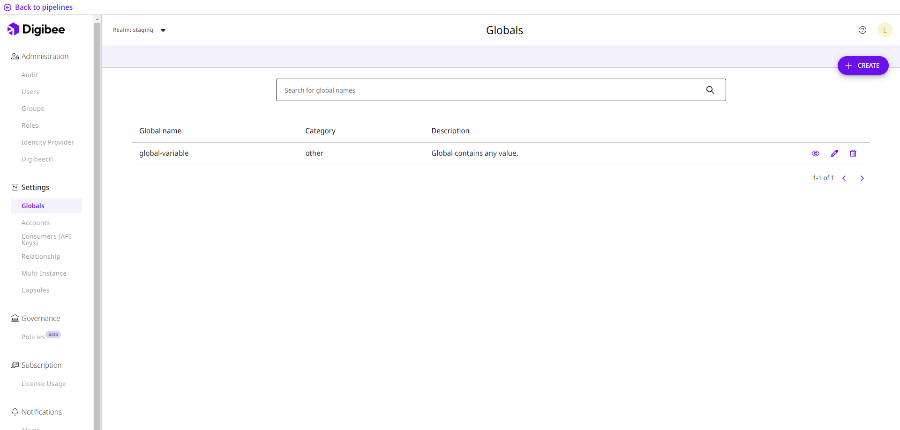

# Globals

## What are Globals?

Global variables are information stored in the Platform that can be reused in different [pipelines](https://docs.digibee.com/documentation/build/pipelines) and [Capsules](https://docs.digibee.com/documentation/build/capsulas) at the same time. Once you have created a Global variable, you can use it in [fields that support IntelliSense](https://docs.digibee.com/documentation/build/double-braces/intellisense) in the configuration form of components.

<figure><figcaption></figcaption></figure>

This feature speeds up development, as you can change the Global variable in one place and the information is passed on to all pipelines and Capsules that use it.


The information on the Global variables is only updated automatically in pipelines that have not yet been deployed. If the pipeline with the changed Global variable has already been deployed, a warning is displayed in its card on the Run page so that it can be redeployed.


## How to use Globals?

Follow these guidelines to use Globals:

* [Create a Global variable](how-to-create-globals.md)
* [Edit or delete a Global variable](how-to-edit-or-delete-globals.md)
* [Use a Global variable](how-to-use-globals.md)
