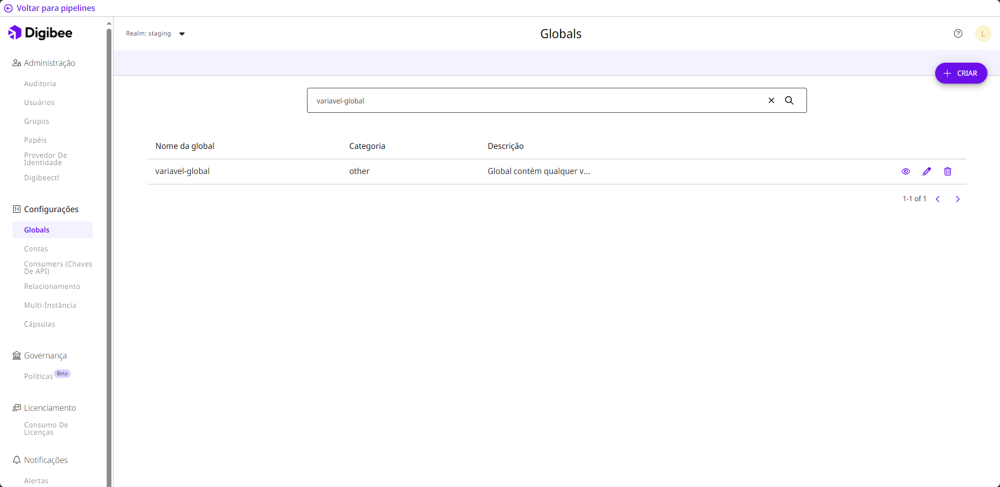

# Globals

## O que são Globals?

Globals são variáveis armazenadas na Plataforma que podem ser reutilizadas em diferentes [_pipelines_](https://docs.digibee.com/documentation/v/pt-br/build/pipelines) e [Cápsulas](https://docs.digibee.com/documentation/v/pt-br/build/capsulas) ao mesmo tempo. Depois de criar uma variável global, você pode usá-la em [campos que suportam o IntelliSense](https://docs.digibee.com/documentation/v/pt-br/build/double-braces/intellisense) no formulário de configuração de componentes.

<figure><figcaption>
Página Globals na Digibee Integration Platform.
</figcaption></figure>

Esse recurso agiliza o desenvolvimento, pois você pode alterar a variável global em um só lugar e as informações são repassadas para todos os _pipelines_ e Cápsulas que a utilizam.


As informações das variáveis ​​globais só são atualizadas automaticamente em _pipelines_ que ainda não foram implantados. Se o _pipeline_ com a variável global alterada já tiver sido implantado, um aviso será exibido em seu cartão na página Run para que ele possa ser reimplantado.


## Como usar Globals?

Siga estes guias para usar globals:

* [Crie uma variável global](how-to-create-globals.md)
* [Edite ou exclua uma variável global](how-to-edit-or-delete-globals.md)
* [Use uma variável global](how-to-use-globals.md)
