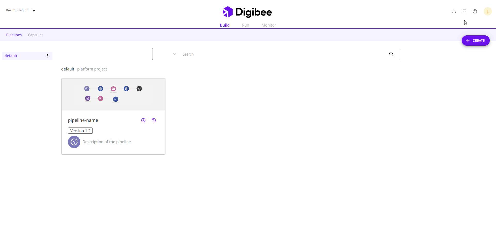

# How to create Globals

Follow these steps to create a Global variable:

1. On the Platform home page, click **Settings** in the upper right corner of the page.
2. In the **Settings** menu, click **Globals**.
3. Click the **Create** button.

<figure><figcaption></figcaption></figure>

4. Fill out the form with the following information:

* **Global name:** the name of the Global variable to be referenced in the pipeline or Capsule. It must be less than 60 characters and can contain only letters, numbers, and the characters \[-] or \[.].
* **Category:** select the category to which your Global variable belongs. Each option has a type of validation:
  * **URL:** checks whether it’s a valid URL.
  * **JDBC:** checks whether it’s a valid string connection.
  * **Email:** checks whether it’s a valid email.
  * **ID:** checks whether only numbers are entered.
  * **Other:** accepts any input, but it must be in lower case. However, as Globals lacks an encryption method, we strongly recommend that you don't add sensitive information such as passwords and tokens.


Each category can only have unique values, except for the **Other** category. If you need to add a list of information, please choose the **Other** category.


* **Description:** a brief text to describe the Global’s purpose.
* **Prod environment:** Global's value in the prod environment. The value can contain up to 10,000 characters.
* **Test environment:** Global's value in the test environment. The value can contain up to 10,000 characters.
* **Other environments value:** if you have other environments in your realm, they will also be listed.


The data used in Globals can be viewed by any user with access to the page and is not encrypted in the database. Make sure that you don't insert any sensitive data. If you need to store encrypted data, please [use Accounts](https://docs.digibee.com/documentation/settings/accounts).​


5. Click **Save**.
6. A pop-up window will open on the page. Write “I want to create the global” in the **Confirmation message** field and click **Create**.
