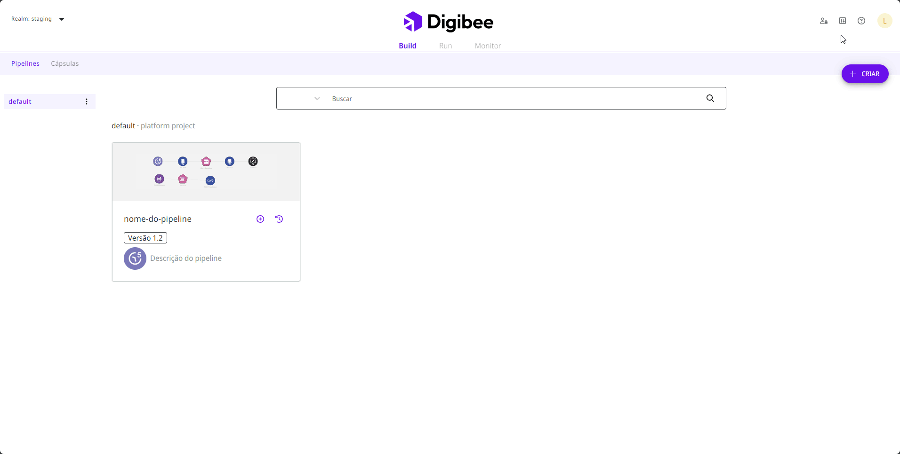

# Como criar Globals

Siga estas etapas para criar uma variável global:

1. Na página inicial da plataforma, clique em **Configurações** no canto superior direito da página.
2. No menu **Configurações**, clique em **Globals**.
3. Clique no botão **Criar**.

<figure><figcaption></figcaption></figure>

4. Preencha o formulário com as seguintes informações:

* **Nome da global:** o nome da variável global a ser referenciada no _pipeline_ ou Cápsula. Deve ter menos de 60 caracteres e pode conter apenas letras, números e os caracteres \[-] ou \[.]. Não são permitidos acentos.
* **Categoria:** selecione a categoria à qual sua variável global pertence. Cada opção possui um tipo de validação:
  * **URL:** verifica se é um URL válido.
  * **JDBC:** verifica se é uma conexão de _string_ válida.
  * **Email:** verifica se é um email válido.
  * **ID:** verifica se apenas números são inseridos.
  * **Other:** aceita qualquer entrada, mas as letras devem ser minúsculas. No entanto, como _Globals_ não possui um método de criptografia, desaconselhamos adicionar informações confidenciais, como senhas e _tokens_.


Cada categoria aceita somente valores únicos, exceto a categoria **Other**. Se precisar adicionar uma lista de informações, por favor escolha a categoria **Other**.


* **Descrição:** um breve texto para descrever o propósito da variável global.
* **Ambiente Prod:** o valor da variável global no ambiente de produção. Pode conter até 10.000 caracteres.
* **Ambiente Test:** o valor da variável global no ambiente de teste. Pode conter até 10.000 caracteres.
* **Valor de outros ambientes:** se você tiver outros ambientes em seu _realm_, eles também serão listados.


Os dados utilizados em _Globals_ podem ser visualizados por qualquer usuário com acesso à página e não são criptografados no banco de dados. Certifique-se de não inserir nenhum dado confidencial. Se você precisar armazenar dados criptografados, por favor [utilize Contas](https://docs.digibee.com/documentation/v/pt-br/settings/accounts).​


5. Clique em **Salvar**.
6. Um pop-up abrirá na página. No campo **Mensagem de confirmação**, escreva “Quero criar a global” e clique em **Criar**.&#x20;
