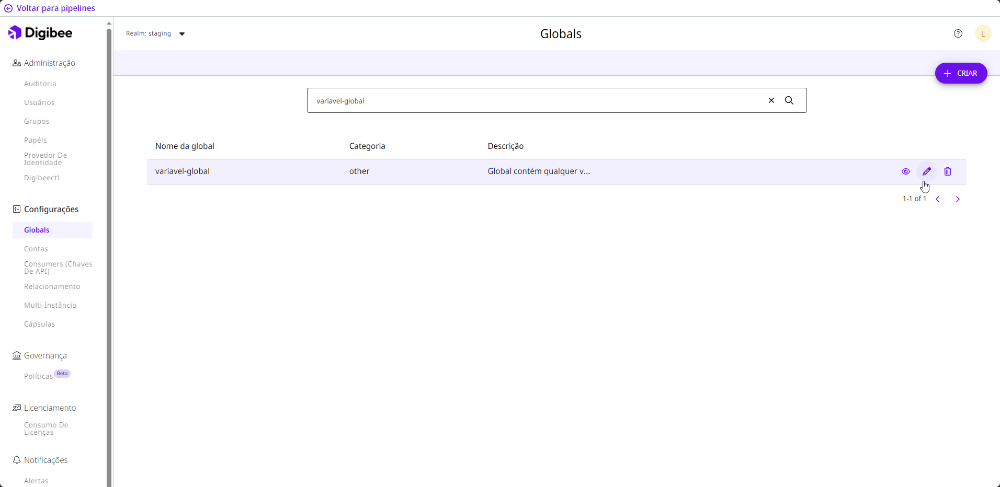

# Como editar ou excluir Globals

Siga estas etapas para editar uma variável global:

1. Na página inicial da Plataforma, clique em **Configurações** no canto superior direito da página.
2. Abaixo do menu **Configurações**, clique em **Globals**.
3. Clique no botão **Editar global**, que é representado por um ícone de lápis.

<figure><figcaption></figcaption></figure>

4. Você pode editar a **Categoria**, **Descrição** e os valores dos ambientes **Prod** e **Test**. O nome não pode ser editado por motivos de auditoria.
5. Abaixo dos campos, você verá uma lista dos _pipelines_ que utilizam a variável global. Se ela for editada, é importante reimplantar os _pipelines_ para garantir que estejam atualizados com as novas informações.


Na página Run, onde você pode ver todos os _pipelines_ implantados, o cartão do _pipeline_ exibe um aviso de que as configurações da variável global foram alteradas.


6. Clique em **Salvar**.
7. Um pop-up abrirá na página. No campo **Mensagem de confirmação**, escreva “Quero editar a global” e clique em **Criar**.&#x20;

Se você deseja excluir a variável global, clique no botão **Remover global**, que é representado pelo ícone da lixeira. Confirme a ação clicando em **Remover** no _pop-up_ que será aberto.
