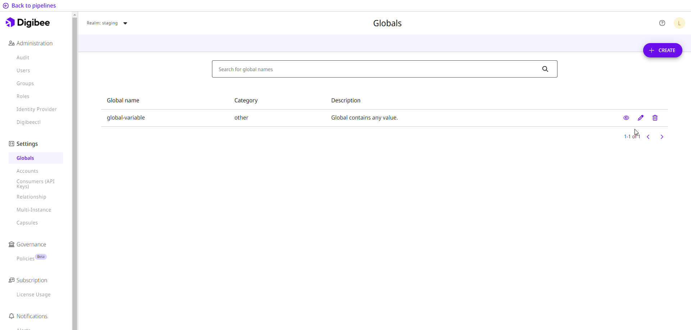

# How to edit or delete Globals

Follow these steps to edit a Global variable:

1. On the Platform home page, click **Settings** in the upper right corner of the page.
2. Below the **Settings** menu, click **Globals**.
3. Click on the **Edit global** button, which is represented by a pencil icon.

<figure><figcaption></figcaption></figure>

4. You can edit the **Category**, **Description**, and the **Prod** and **Test** environment values. The name can’t be edited for audit reasons.
5. Below the fields, you will see a list of the pipelines that use the Global. If the Global is edited, it’s important to redeploy the pipelines to ensure they are up to date with the new information.


On the Run page, where you can see all deployed pipelines, the pipeline card displays a warning that the Global settings have been changed.


6. Click **Save**.
7. 6\. A pop-up window will open on the page. Write “I want to edit the global” in the **Confirmation message** field and click **Create**.

If you want to delete the Global, click the **Delete global** button, which is represented by the trash can icon. Confirm the action by clicking **Delete** in the pop-up window.
