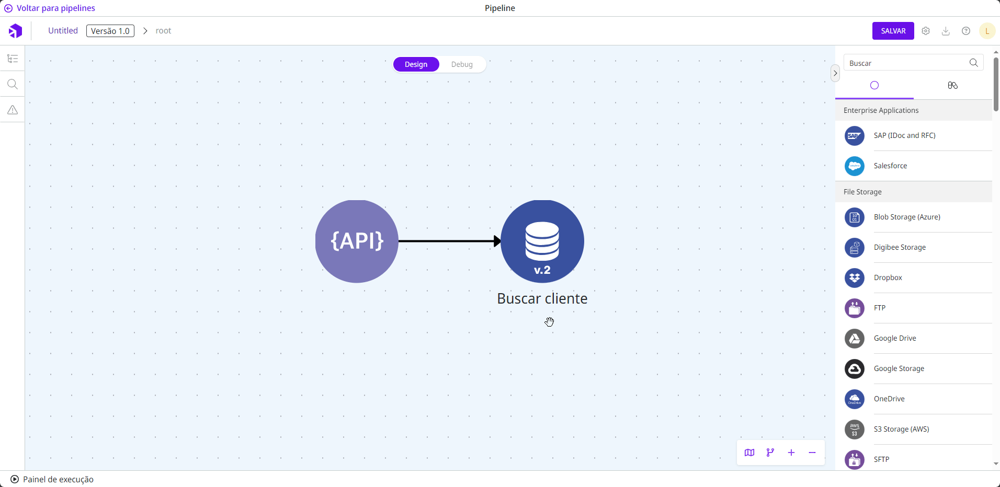

# Como usar Globals

Variáveis ​​globais somente podem ser usadas em campos de componentes que [suportam IntelliSense](https://docs.digibee.com/documentation/build/double-braces/intellisense).

Siga estas etapas para usar uma variável global:

1. Abra o _pipeline_ ou Cápsula.
2. Arraste o componente desejado para o canvas.
3. Se o campo no formulário de configuração do componente suportar IntelliSense, uma lista de variáveis globais disponíveis aparecerá no lado direito da página. Clique na variável global que deseja adicionar ao formulário de configuração do componente.
4. Alternativamente, você pode referenciar a variável global manualmente usando a expressão`{{global.GlobalName}}`. Simplesmente substitua `GlobalName` pelo nome da variável global que você salvou ao criar a variável global na plataforma, por exemplo`{{global.db-timeout}}`.


Mesmo que você faça referência à variável global manualmente, isso só deverá ser feito em campos que oferecem suporte ao IntelliSense.


O exemplo a seguir mostra como você pode usar uma variável global:

<figure><figcaption></figcaption></figure>

No componente [**REST V2**](https://docs.digibee.com/documentation/components/web-protocols/rest-v2), o parâmetro **Database URL** suporta [**IntelliSense**](https://docs.digibee.com/documentation/build/double-braces/intellisense). Se você clicar no parâmetro, uma lista das variáveis globais criadas no _realm_ será exibida no lado direito da página. Por exemplo, nós clicamos na variável global **url-db** e o parâmetro **Database URL** foi preenchido com a expressão`{{global.url-db}}`.
