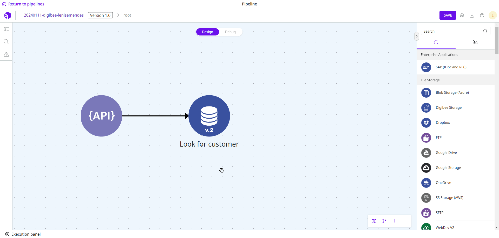

# How to use Globals

Global variables can be used in fields of components that [support IntelliSense](https://docs.digibee.com/documentation/build/double-braces/intellisense).

Follow these steps to use a Global variable:

1. Open the pipeline or Capsule.
2. Drag the desired component onto the canvas.
3. If the field in the component's configuration form supports IntelliSense, a list of available Globals will appear on the right side of the page. Click the Global variable that you want to add to the configuration form of the component.
4. Alternatively, you can reference the Global variable manually using the expression `{{global.GlobalName}}`. Simply replace `GlobalName` with the name of the Global variable that you saved when creating the Global variable in the Platform, for example `{{global.db-timeout}}`.


Even if you reference the Global variable manually, this should only be done in fields that support IntelliSense.


The following example shows how you can use a Global variable:

<figure><figcaption></figcaption></figure>

In the [**REST V2**](https://docs.digibee.com/documentation/components/web-protocols/rest-v2) component, the **Database URL** parameter supports [**IntelliSense**](https://docs.digibee.com/documentation/build/double-braces/intellisense). If you click the parameter, a list of the Globals created on the realm is displayed on the right side of the page. For example, we clicked the Global variable **url-db** and the **Database URL** parameter was filled in with the expression `{{global.url-db}}`.
