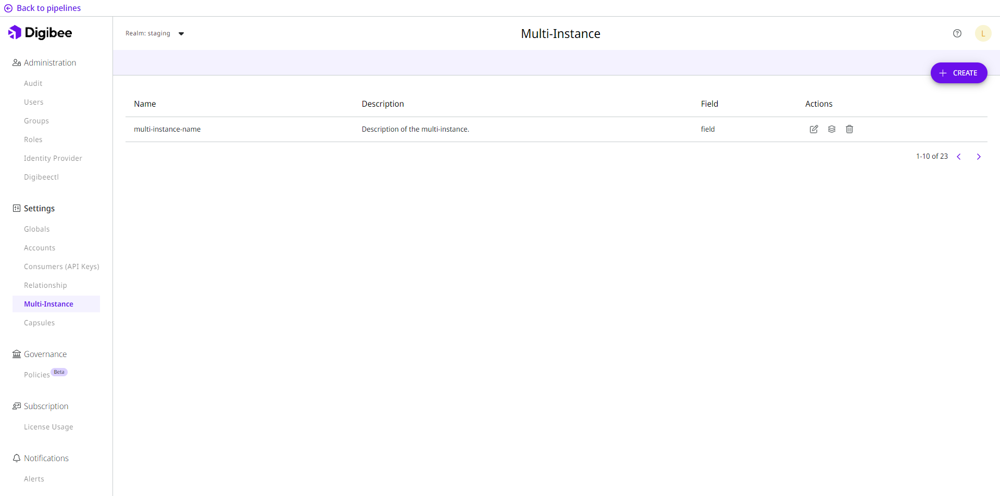

# Multi-Instance

This feature is often used when we need to use the same pipeline, that is, the same construction logic, to access different endpoints such as Accounts and Globals. This eliminates the need for multiple versions of the same pipeline.

## What is it and how it works

The multi-instance functionality allows the deployment of the same pipeline multiple times, taking into account different parameters. In this way, it is possible to configure multiple instances that process data according to the parameters configured in each one, using the same integration flow.

With this functionality, you can design an accelerated data extraction strategy that uses multi-instance pipelines to quickly and safely extract large amounts of data from a database.

## Overview 

<figure><figcaption></figcaption></figure>

On the **Settings** page, the **Multi-Instance** menu lists all multi-instance models already created in the Platform and their respective configuration parameters. These are:

* **Name:** name of the multi-instance model;
* **Description:** description of the multi-instance model;
* **Field:** the variables to receive the values in each environment.

It is possible to edit, configure and delete the multi-instance models listed. Also, you can deploy your multi-instance pipelines, [to know how to deploy a multi-instance pipeline see this article. ](https://docs.digibee.com/documentation/settings/multi-instance/multi-instance)Below are some actions that can be taken:

### Edit a multi-instance 

This action allows you to edit all configuration parameters defined at the time of creating the new multi-instance model. These are **Name**, **Description**, and **Field**.

### Configure 

This action allows you to create, configure and save instances of each model, as well as insert and define values for each previously created field.

### Delete a multi-instance model 

Use this action to delete a multi-instance model when it is no longer used on the Platform, whether in deployed, non-deployed, or archived pipelines.

## Use cases 

Let's create a pipeline, define it as multi-instance, and also create a configuration with the instances to be used, specifying determined intervals for each of them. \
This way, each instance is responsible for extracting data between specific dates, as in the following example:

| **INSTANCE** | **INTERVAL** |
| ------------ | ------------ |
| Period 1     | 10/1-8       |
| Period 2     | 10/8-16      |
| Period 3     | 10/16-24     |
| Period 4     | 10/24-31     |

The **Period 1 instance** is responsible for extracting all data between October 1 and October 8, in as many runs as necessary. The instances **period 2, 3** and **4** use the same extraction logic as the first instance for different time intervals.&#x20;

So, they apply a strategy that uses specific dates and pipelines with multiple instances to extract a large amount of data faster.&#x20;

It would be perfectly possible to perform data extraction with a simple pipeline. However, if you use a pipeline with multiple instances, the extraction can be performed up to 4 times faster.

### Use it in a different environment

In addition, you can use a multi-instance pipeline to run an identical query against databases installed in different environments.

You can also publish pipelines in two different environments. To do this, simply deploy a multi-instance pipeline to the Digibee Integration Platform test environment and configure it to report to two of your environments, for example, QA and test. This way, we would have two test deployments reporting to two environments.
