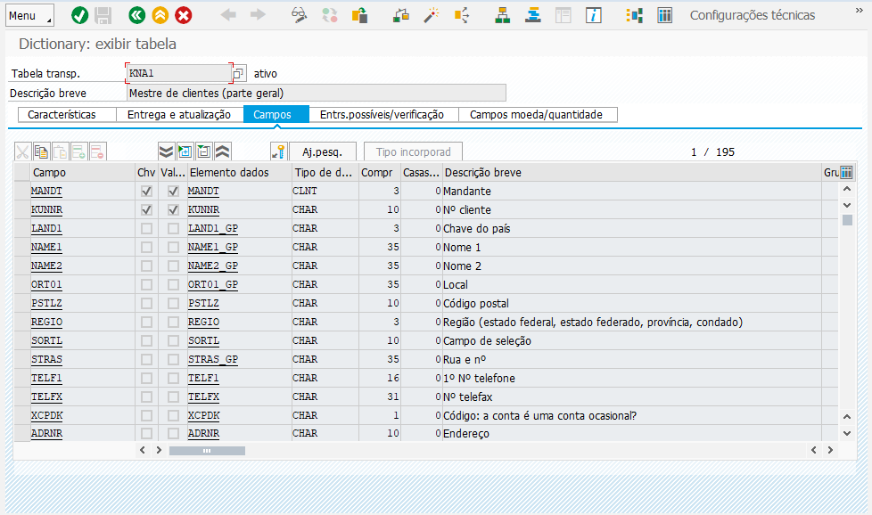
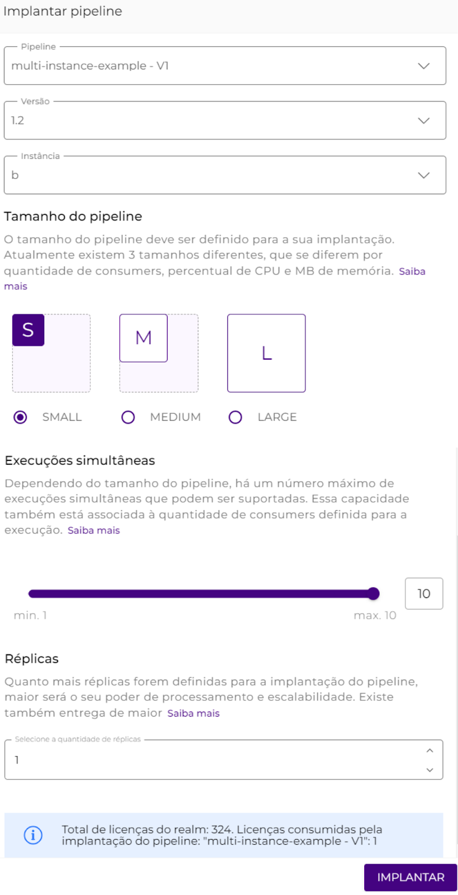
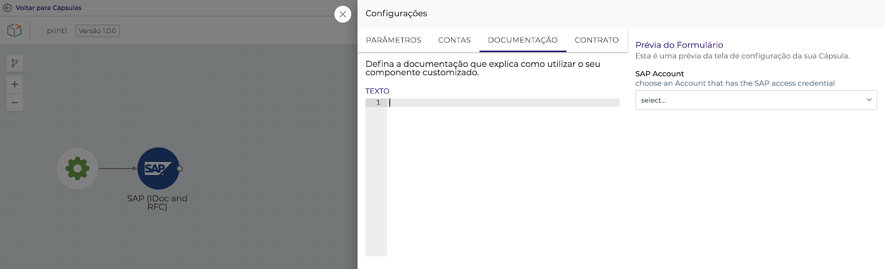

# Deploying a multi-instance pipeline

## **How to deploy a multi-instance pipeline**_**?**_ 

### 1. Create the multi-instance model 

Before you create the instances, you need to create a multi-instance model. To do this, go to the **Multi-instance** page, click **+Create**, and define a name, description, and the fields of the instances, that is, the variables that should receive values in each environment.

Take a look at the following example:

.png>)

Once this is done, click **Confirm** to create the model.

### 2. Configure the instances 

Now, you can create the instances that will match the model you created in the last step. To do this, find the model in the list and click on the corresponding **Configure** action button. This way you can create the instances of this model one by one, entering and setting values for each field.

In the following example, a and b are two stores that receive the values of each variable that can be configured for both test and prod. This is repeated for all other instances to be created.

.png>)

After entering the variables, just click **Save**.

### 3. Create a multi-instance pipeline 

In this step, we create a pipeline and define it as a multi-instance. To do this, access the settings by clicking on the Settings button:

.png>)

Select the "**Is it a multi-instance?**" option, as in the following example:

.png>)

After selecting the "**Is it multi-instance?**" option, specify which multi-instance model the pipeline will report to. In our example, we are using the "article-multi-instance" model.


**Important:** Once the pipeline is set to multi-instance, it is not possible to undo this setting. On the other hand, it is possible to convert any pipeline, whether already deployed or not, to a multi-instance pipeline.


Since this is an event, we need to inform the trigger an instance variable that will be executed using the pattern **`-{{replica.instance_variable_name}}.`**, as in the example below:

<figure><figcaption></figcaption></figure>

#### Running queries in Execution panel 

If you are running an execution in a multi-instance pipeline, you can select the instance you want to run in the TEST tab, as in the following example:

<figure><figcaption></figcaption></figure>

In this way, it is possible to consult the values previously configured in the selected instance via the pattern **`{{replica.instance_variable_name}}`**.

### 4. Deploying a multi-instance _pipeline_ 

Now that you have configured the template and set the pipeline to multi-instance, you need to edit the pipeline request with the instance on which you want to deploy it. This way, the instance name will be added to the pipeline name after deployment.&#x20;

**For example**: once the "multi-instance-example" pipeline is deployed on instance a, its name on the **Run** pipeline card will be "multi-instance-example-a".

In the following example, the "multi-instance-example" pipeline is deployed on **instance a**.

In the example below, the "multi-instance-example" pipeline is being deployed to **instance b**.

After editing, simply click **Deploy**.

Below is the “multi-instance-example” pipeline already deployed on instances a and b in the Run phase shown in the pipeline card:

