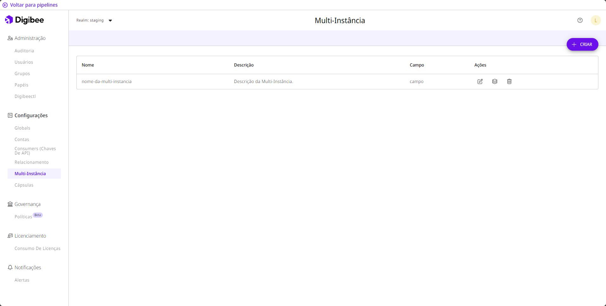

# Multi-Instância

Esta funcionalidade é muito utilizada quando precisamos utilizar o mesmo _pipeline_, isto é, a mesma lógica de construção, para acessar _endpoints_ diferentes, como Contas e _Globals_, dispensando a necessidade de diversas versões do mesmo _pipeline_.

## O que é e como funciona

A funcionalidade multi-instância permite a implantação de um mesmo _pipeline_ múltiplas vezes, atendendo a parâmetros diferentes. Desse modo, é possível configurar múltiplas instâncias que processem os dados conforme os parâmetros configurados em cada uma, utilizando o mesmo fluxo de integração.

Com essa funcionalidade, você consegue arquitetar uma estratégia de extração acelerada de dados, a qual utiliza de _pipelines_ multi-instância para extrair grandes quantidades de dados de um banco de dados de maneira rápida e segura.

## Visão geral 

Localizado na página de **configurações**, a página **Multi-instância** disponibiliza a listagem de todos os modelos de multi-instância já criados dentro da Plataforma e seus respectivos parâmetros de configuração. São eles:

* **Nome:** nome do modelo de multi-instância;
* **Descrição:** descrição do modelo de multi-instância;
* **Campo: as variáveis que receberão os valores em cada ambiente.**

É possível editar, configurar e excluir os modelos de multi-instância listados. Além disso, você pode implantar seus _pipelines_ de multi-instância, [para saber como implantar um _pipeline_ de multi-instância veja este artigo.](https://docs.digibee.com/documentation/v/pt-br/configurations/multi-instancia/multi-instancia)  \
Veja a seguir algumas ações que podem ser realizadas:

### Editar uma multi-instância 

Esta ação permite editar todos os parâmetros de configuração definidos no momento da criação do novo modelo de multi-instância. São eles: **Nome**, **Descrição** e **Campo**.

### Configurar 

Esta ação permite criar, configurar e salvar as instâncias de cada modelo, inserindo e definindo valores para cada campo criado previamente.

### Remover um modelo de multi-instância 

Através desta ação, é possível excluir um modelo de multi-instância caso este não esteja sendo utilizado na Plataforma, seja em _pipelines_ implantados, não implantados ou arquivados.

## Casos de uso 

Vamos criar um _pipeline,_ defini-lo como multi-instância e também criar uma configuração com as instâncias a serem utilizadas, estabelecendo intervalos específicos para cada uma delas. Desse modo, cada instância fica encarregada de extrair dados entre determinadas datas, como no exemplo abaixo:

| **INSTÂNCIA** | **INTERVALO** |
| ------------- | ------------- |
| Período 1     | 1-8/out       |
| Período 2     | 8-16/out      |
| Período 3     | 16-24/out     |
| Período 4     | 24-31/out     |

A instância **Período 1** é responsável por extrair todos os dados entre os dias 1 e 8 do mês de outubro, através de quantas execuções forem necessárias. As instâncias **Períodos** **2**, **3** e **4** utilizam da mesma lógica de extração da primeira para buscarem e extraírem todos os dados nos demais intervalos de tempo.&#x20;

Assim, você estará aplicando uma estratégia que utiliza de datas específicas e de _pipelines_ multi-instância para extrair uma grande quantidade de dados mais rapidamente.&#x20;

Seria perfeitamente possível realizar a extração de dados utilizando um _pipeline_ simples, no entanto, ao utilizar um _pipeline_ multi-instância, a extração pode ser realizada até 4 vezes mais rápido.

### Use-o em diferentes ambientes

Além disso, você consegue utilizar um _pipeline_ multi-instância para executar uma consulta idêntica em bancos de dados instalados em ambientes diferentes.

Também é possível publicar _pipelines_ em dois ambientes diferentes. Para isso, basta publicar um _pipeline_ multi-instância no ambiente _test_ da Digibee Integration Platform e configurá-lo para reportar a dois dos seus ambientes, por exemplo, _QA_ e _test_. Assim, teríamos duas publicações em _test_ reportando para dois ambientes.
