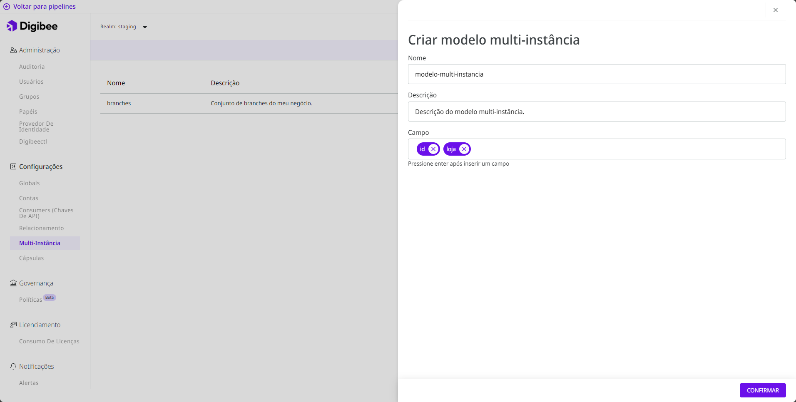
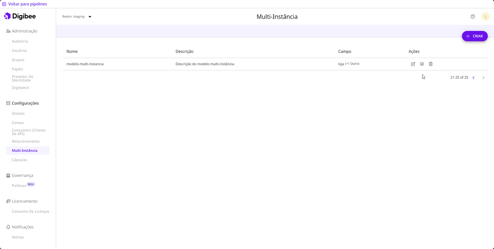
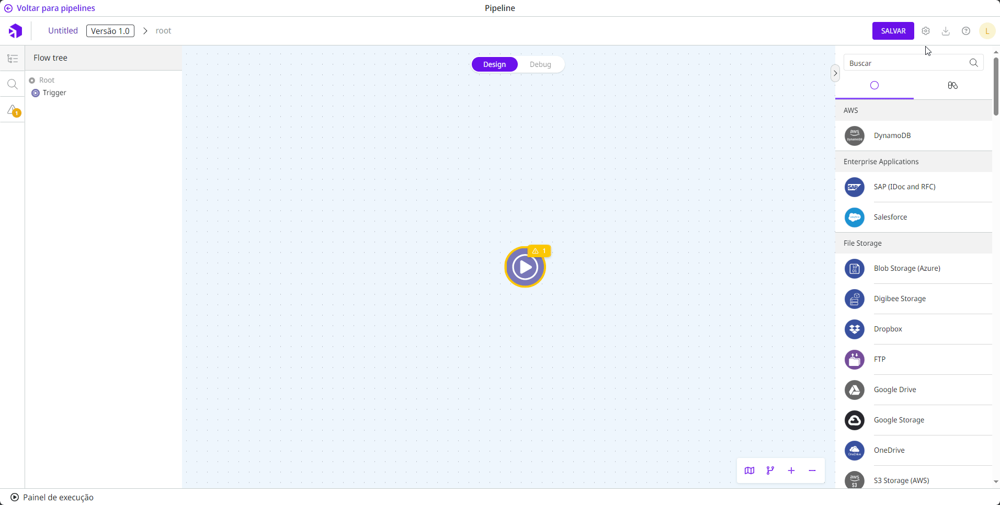
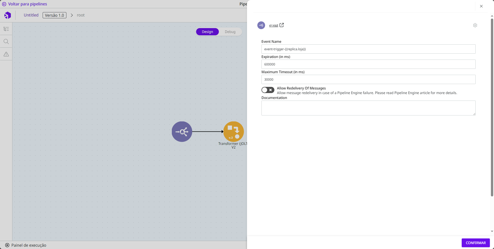
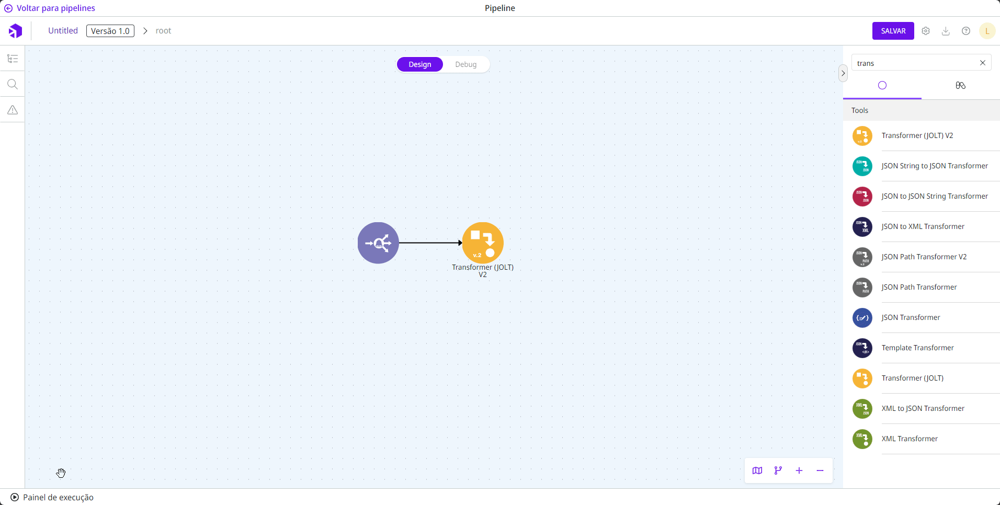
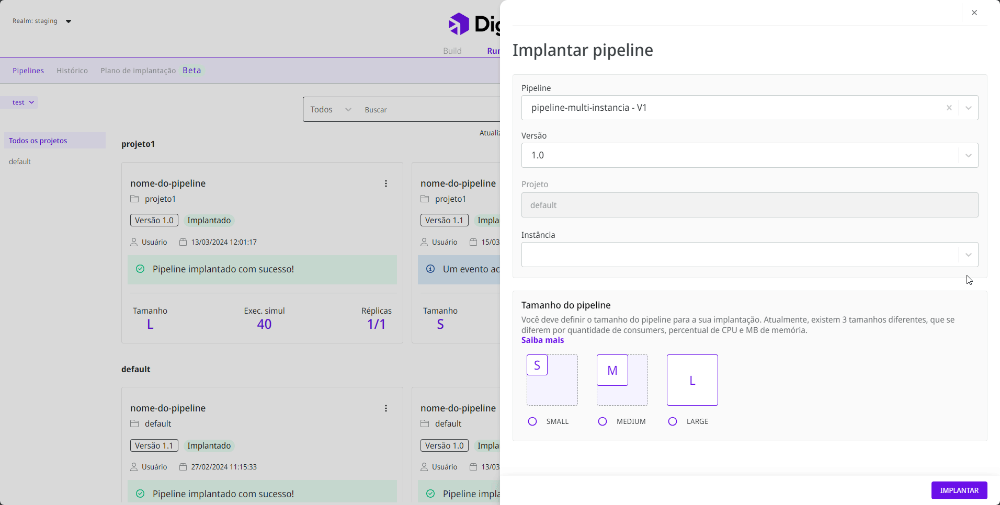
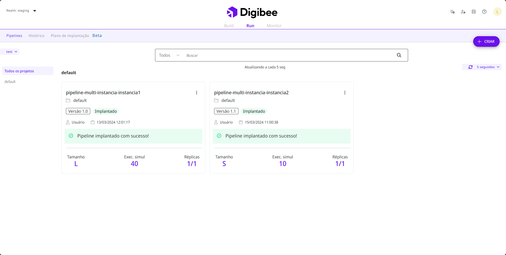

# Implantando um pipeline de multi-instância

## **Como implantar um pipeline** multi-instância? 

### 1. Crie o modelo de multi-instância 

Antes de criar as instâncias, você deverá criar um modelo de multi-instância. Para isso, acesse a página **Multi-Instância**, em **Configurações**, clique em **Criar** e defina um nome, uma descrição e os campos das instâncias, isto é, as variáveis que receberão os valores em cada ambiente.&#x20;

Veja o exemplo abaixo:

Feito isso, clique em **Confirmar** para criar o modelo.

### 2. Configure as instâncias 

Agora, você poderá criar as instâncias que corresponderão ao modelo criado na última etapa. Para isso, localize o modelo na listagem e clique no botão da ação **Configurar** correspondente a ele. Desse modo, você poderá criar as instâncias desse modelo uma a uma inserindo e definindo valores para cada campo.

No exemplo abaixo, "instancia1" e "instancia2" são duas lojas que receberão os valores de cada variável que podem ser configuradas tanto para _test_ quanto para _prod._ Isso se repete para todas as demais instâncias a serem criadas.

Após informar as variáveis, basta clicar em **Salvar**.

### 3. Crie um pipeline multi-instância 

Nesta etapa, vamos criar um _pipeline_ e defini-lo como multi-instância. Para isso, acesse as configurações clicando no botão de **Configurações** e ativando a opção **É multi-instância?**:

Após a opção **É multi-instância?** ser selecionada, informe a qual modelo de multi-instância o _pipeline_ reportará. No nosso exemplo, estamos utilizando o "modelo-multi-instancia".&#x20;


Após definir o _pipeline_ como multi-instância, não será possível reverter essa configuração. Por outro lado, é possível transformar qualquer _pipeline_, implantado ou não, em um _pipeline_ multi-instância.


Por ser um evento, devemos informar no _trigger_ uma variável da instância que será executada através do padrão **`-{{replica.nome_da_variavel_da_instância}}`**, como no exemplo abaixo:

#### **Realizando consultas no Painel de execução**

Ao executar o teste no Painel de execução em um _pipeline_ multi-instância, a primeira coluna da aba **Teste** permitirá que você informe a instância a qual pretende executar, como no exemplo abaixo:

<figure><figcaption></figcaption></figure>

Desse modo, é possível consultar os valores previamente configurados na instância selecionada através do padrão **`{{replica.nome_da_variável_da_instância}}`**.

### 4. Implantando um pipeline multi-instância 

Agora que você já configurou o modelo e definiu o _pipeline_ como multi-instância, é necessário editar a solicitação do _pipeline_ com a instância em que pretende implantá-lo. Desse modo, o nome da instância será adicionado ao nome do _pipeline_ após a implantação.&#x20;

**Por exemplo**: uma vez que o "pipeline-multi-instancia” for implantado na "instancia1", seu nome no _card_ do _pipeline_ na aba **Run** será "pipeline-multi-instancia-instancia1".

No exemplo abaixo, o “pipeline-multi-instancia” está sendo implantado na "instancia1" e "instancia2".

Após a edição, basta clicar em **Implantar**.

Abaixo, o “pipeline-multi-instancia” já implantado nas instâncias "instancia1" e "instancia2", na aba de **Run** mostrada no card do _pipeline_:

