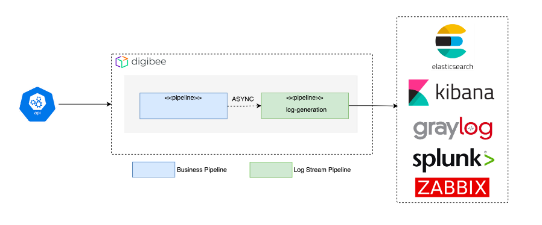

# Como enviar logs para serviços externos

Logs são  essenciais para entender o que aconteceu durante as execuções de seus pipelines e como resolver problemas neles. Você pode ver os logs de uma execução de um pipeline na página de Pipeline Logs, na aba Monitor. Você também pode construir fluxos de integração que exportam logs para outros sistemas de monitoramento, como o ElasticSearch, Kibana, Graylog, Splunk ou Zabbix. Entenda como fazer isso:

## Arquitetura de pipelines para transmissão de logs

Antes de continuar, você deve estar familiarizado com a arquitetura orientada a eventos. Para aprender mais sobre esse método, [clique aqui](https://docs.digibee.com/documentation/v/pt-br/tutoriais-e-melhores-praticas/arquitetura-orientada-a-eventos?q=eventos).

Para seguir uma arquitetura para transmissão de logs, você precisa dividir seu fluxo de integração entre dois pipelines : o pipeline de regra de negócio (_Business Rule_) e o pipeline de transmissão de logs (_Log Stream_). Esse modelo é chamado _Log Stream Pattern_.

No _Log Stream Pattern_, o pipeline de transmissão de logs recebe os logs do pipeline de regra de negócio e os envia ao sistema de monitoramento desejado. Utilizando esse modelo de execução paralela, você evita sobrecarregar o pipeline principal ou atrasar sua execução.

<figure><figcaption>
Log Stream Pattern
</figcaption></figure>

## Pipeline de regra de negócio

Em pontos estratégicos do pipeline de regra de negócio, nos quais você normalmente colocaria um componente Log, siga esses passos:

&#x20; 1\. **Coloque um componente Session Management com configuração “put data”**

Use esse componente para armazenar o payload para um possível uso posterior no seu fluxo de integração. Isso é considerado uma boa prática na arquitetura de pipelines.

&#x20; **2.  Coloque um componente Block Execution**

O Block Execution cria dois subpipelines : o subpipeline obrigatório “onProcess”, que é executado por padrão, e o subpipeline opcional “onException”, que é executado quando um erro ocorre durante a execução do subpipeline “onProcess”.

&#x20; **3.  No subpipeline “onProcess” do componente Block Execution, coloque um componente Log e um componente Event Publisher**

Este Event Publisher é responsável por ativar o pipeline de transmissão de logs. A configuração Body deste componente deve conter os dados aos quais você quer ter acesso ao lidar com um possível erro no seu fluxo de integração.

&#x20; **4. Coloque um componente Throw Error no subpipeline “onException” do Block Execution**

Você poderia deixar esse subpipeline vazio, mas isso não é considerado uma boa prática.

A parte do seu pipeline de regra de negócio na qual você normalmente colocaria um componente Log deve estar parecida com isso:

<figure><figcaption>
<strong>Exemplo de pipeline de regra de negócio</strong>
</figcaption></figure>

## Pipeline de transmissão de logs

No pipeline de transmissão de logs, siga esses passos:

&#x20; 1 . **Configure o trigger do pipeline para um Event Trigger e configure o nome do evento nas configurações do trigger para o mesmo nome que você usou no componente Event Publisher do pipeline de regra de negócio**

Ao fazer isso, o pipeline de transmissão de logs será ativado quando um log for registrado no pipeline de regra de negócio.

&#x20; **2. Coloque um componente que se comunique com seu sistema externo, como o REST V2 ou SOAP V3, e configure-o para que envie o log para ele**

Você pode enviar o log para vários sistemas ou escolher para qual sistema enviar, a depender da estrutura do payload do log. No exemplo abaixo, nós usamos um componente Choice para enviar o log para o Graylog ou para o Kibana por meio de um componente REST V2.

<figure><figcaption>
<strong>Exemplo de pipeline de transmissão de logs</strong>
</figcaption></figure>


**usar um número excessivo de componentes Log pode comprometer a performance do seu pipeline e requerer um maior tamanho de implementação do pipeline.**


## Informações adicionais

* Em vez de um segundo pipeline, você também pode utilizar cápsulas - aprenda mais sobre cápsulas e sobre as melhores práticas ao utilizá-las [aqui](https://docs.digibee.com/documentation/v/pt-br/build/capsulas/capsulas-duvidas-frequentes).
