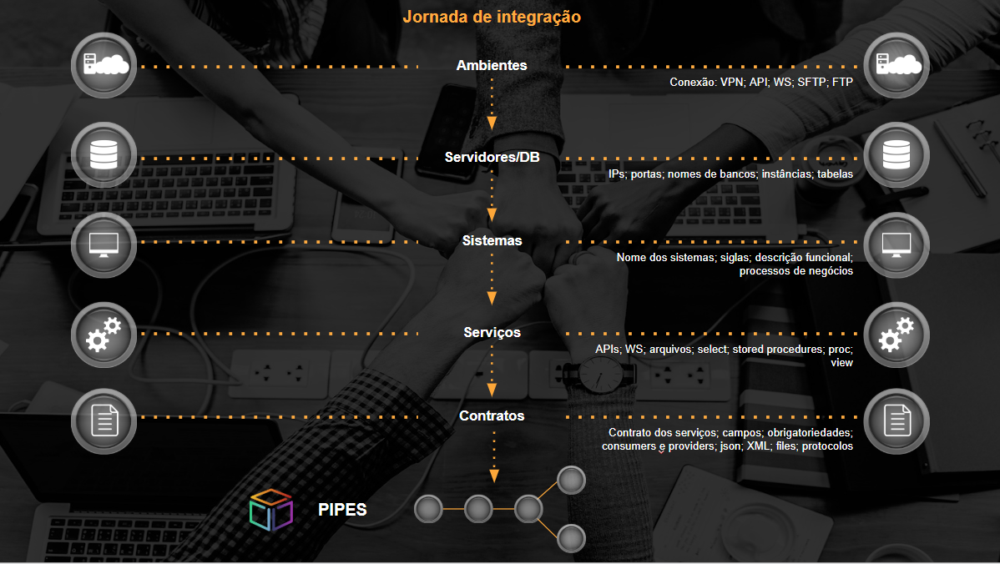
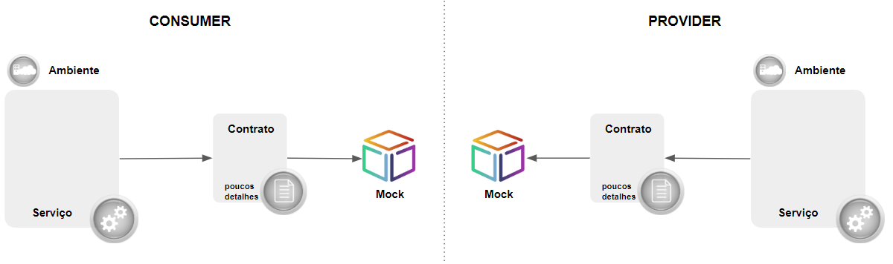
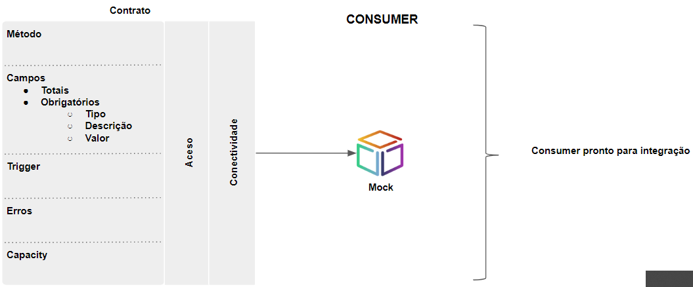
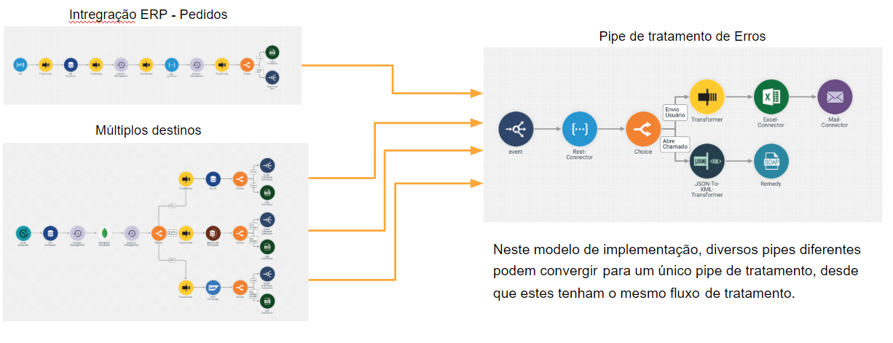

# Integration Journey

The system integration process using the Digibee Integration Platform is very simple. We just have to engage the correct teams and follow the below-described steps.

1. **ENVIRONMENTS**

Connection - it establishes the connection between environments that will be integrated and Digibee

* VPN: Point-to-point connection with customers
* Exposed: API, WS, SFTP, FTP, which are displayed in the internet in a safe way

\_\_\_\_\_\_\_\_\_\_\_\_\_\_\_\_\_\_\_\_\_\_\_\_\_\_\_\_\_\_\_\_\_\_\_\_\_\_\_\_\_\_\_\_\_\_\_\_\_\_\_\_\_\_\_\_\_\_\_\_\_\_\_\_\_\_

**2. SERVERS / DB**\
Application servers and database serves

* Servers: IP and port numbers to clear access at internal firewalls
* Database: IP, ports, database names, instances, tables

\_\_\_\_\_\_\_\_\_\_\_\_\_\_\_\_\_\_\_\_\_\_\_\_\_\_\_\_\_\_\_\_\_\_\_\_\_\_\_\_\_\_\_\_\_\_\_\_\_\_\_\_\_\_\_\_\_\_\_\_\_\_\_\_\_\_

**3. SYSTEMS**\
Systems that will be integrated

* System names, acronyms, functional description
* Business processes that will be integrated and integration flows
* Error treatments

In this phase, we will define what we will deliver at the integration set-up process. We will define integrations and flows, which will guide us to the final solution design, and number of necessary pipes for meeting each flow.

\
\_\_\_\_\_\_\_\_\_\_\_\_\_\_\_\_\_\_\_\_\_\_\_\_\_\_\_\_\_\_\_\_\_\_\_\_\_\_\_\_\_\_\_\_\_\_\_\_\_\_\_\_\_\_\_\_\_\_\_\_\_\_\_\_\_

**4. SERVICES**\
Data integration services

* API, Web services, files
* Database: select, store procedures, proc, view

Concluding sequence diagrams, improving details about the contract required by the “consumer”, and the information provided by “providers”. Detailing about endpoints that will be accessed, and permits, exception cases, and error dealings.

Example:

* input: zip code in the \[0-9]\[0-9]\[0-9]-\[0-9]\[0-9]\[0-9]\[0-9] format\\
* output: “é São Paulo” “não é São Paulo”
* viacep access in the format:

.png>)

Query if it belongs to SP from a ZIP Code

Customer System Digibee ViaCep

GET consultaCEP(cep) GET viaCep(cep)

City data from ZIP Code

belongs or not to SP

Customer System Digibee ViaCep

Rem.: _in this phase, the customer can already anticipate its systems' validation, and assure that they are prepared to be integrated._

_Example: API test, FTP access test, database query validation, etc._

The customer may use external tools (such as Postman, for example) or use the DGB platform as data mock for such validation. \_\_\_\_\_\_\_\_\_\_\_\_\_\_\_\_\_\_\_\_\_\_\_\_\_\_\_\_\_\_\_\_\_\_\_\_\_\_\_\_\_\_\_\_\_\_\_\_\_\_\_\_\_\_\_

**5. CONTRACTS**\
Service contracts

* Service contract, fields, duties
* Data CONSUMERS and PROVIDERS
* 'De-Para' \['From-To'] between systems that will be integrated
* Json, XML, files, communication protocols
* Message examples; data models

Technical specification: in this phase, we need to know the business flow (what one can expect from integration) and contract fields (data dictionary), for data TO / FROM construction. It is necessary to count on the integration Owner's participation with expected well-defined results, and teams holding the knowledge of the systems that are being integrated.

_example_:

.png>)

**Provider** Trigger: Customer system access (GET to REST)

ZIP CODE City

Access to viacep to retrieve city name from ZIP code

Checks if the city is, or is not equal to São Paulo

“it is São Paulo" / “it is not São Paulo"

**Consumer** answer to customer system

_example:_

.png>)

**System A: Provider (Database) System B: Consumer (web service)**\
**\[customerid]**\
**\[customername]**\
**\[customeraddress]**\
**\[customerphone]**\
**\[customeremail]**\
\_\_\_\_\_\_\_\_\_\_\_\_\_\_\_\_\_\_\_\_\_\_\_\_\_\_\_\_\_\_\_\_\_\_\_\_\_\_\_\_\_\_\_\_\_\_\_\_\_\_\_\_\_\_\_\_\_\_\_\_\_\_\_\_\_\_

**6. PIPES**

.png>)

Integration pipe construction (connectors, transformation, validation, data quality, orchestration, security), and deploy into production.

Pipe construction steps:

**a) INTEGRATION MOCK**

The deployment model must follow a predefined script to assure that the "edges" are prepared to be integrated. Therefore, the first step is to assure the proper operation of internal system services. Only after this validation we can start constructing the integration. System responsible persons can use the DGB Platform as data mock for their tests, allowing them to isolate data and already simulating the actual scenario. It is also possible that the customer tests its services via other applications available, such as the "_Postman_", for instance. In this phase, a pre-requirement is to have the Integration owner.

**b) ERROR TREATMENT**

All pipes must be constructed with error deals. Connectivity, access, data, and volumetric errors may occur, which must feature an automated treatment within the platform. An alternative that is frequently used by Digibee is the creation of error EVENTS and ERROR TREATMENT pipes, which are initiated by such events.

_example:_

ERP Integration – Orders

Multiple destinations

Error treatment pipe

Within this deployment model, several different pipes may converge to a single treatment pipe provided that they feature the same treatment flow.

**c) UNIT TEST**

Pipe and unit test deployment on each of the steps (minimum data volume for development, example json, file template, etc.).

**d) INTEGRATED TEST and HOMOLOGATION**

Pipe promotion for test environment, integration test scenario execution, flow result acceptance.

_example:_

This phase mitigates possible production errors. A pipe must not be published into production without undergoing integrated tests and by integration owner homologation.

**Important**: Capacity Planning\
This is the moment of beginning to plan the deploy into production. The content/data type of this integration flow, payload size, concurrent consumer quantity, necessary performance according to the business requirement (messages per second, for instance) and criticality, will define the capacity configured for **pipe** deployment:

* define volume
* define criticality
* define pipe size

**e) PRODUCTION**

Planning deploy into production:

1. Test/validate accesses into production environment
2. Check environment variables
3. Validate that all integrated tests have been successfully performed
4. Integration owner sign-off
5. Validate pipe capacity
6. Deploy into production (customer performs the deploy)

\_\_\_\_\_\_\_\_\_\_\_\_\_\_\_\_\_\_\_\_\_\_\_\_\_\_\_\_\_\_\_\_\_\_\_\_\_\_\_\_\_\_\_\_\_\_\_\_\_\_\_\_\_\_\_\_\_\_\_\_\_\_\_\_\_\_\
**TIMELINE**

\_\_\_\_\_\_\_\_\_\_\_\_\_\_\_\_\_\_\_\_\_\_\_\_\_\_\_\_\_\_\_\_\_\_\_\_\_\_\_\_\_\_\_\_\_\_\_\_\_\_\_\_\_\_\_\_\_\_\_\_\_\_\_\_\_\_\
**ARTIFACTS**\
Document for establishing **VPN, list integrations, and define the 'De-Para' among systems**:\
[https://docs.google.com/spreadsheets/d/1UL-h8Kt0IEmPgJj9dcN2q9Mqk3CKmVA-Jqoqz-V-6e8/edit#gid=85364770](https://docs.google.com/spreadsheets/d/1UL-h8Kt0IEmPgJj9dcN2q9Mqk3CKmVA-Jqoqz-V-6e8/edit#gid=85364770)
