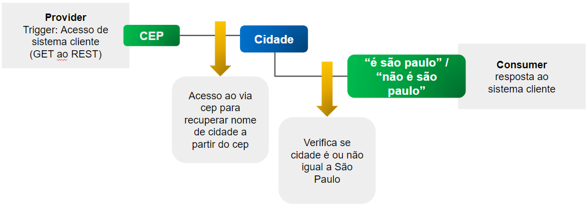

# Jornada de Integração

O processo de integração de sistemas com a Digibee Integration Platform é bastante simples. Basta envolvermos as equipes corretas e seguirmos os passos descritos abaixo.

**1. AMBIENTES**

Conexão - estabelece a conexão entre os ambientes que serão integrados e a Digibee

* VPN: Conexão ponto a ponto com os clientes
* Expostos: API, WS, SFTP, FTP, que são expostos na internet de maneira segura

\_\_\_\_\_\_\_\_\_\_\_\_\_\_\_\_\_\_\_\_\_\_\_\_\_\_\_\_\_\_\_\_\_\_\_\_\_\_\_\_\_\_\_\_\_\_\_\_\_\_\_\_\_\_\_\_\_\_\_\_\_\_\_\_\_\_

**2. SERVIDORES / DB**\
Servidores de aplicação e servidores de bancos de dados

* Servidores: Números de IP e portas para liberação de acesso nos firewalls internos
* Base de Dados: IP, portas, nome dos bancos, instâncias, tabelas

\_\_\_\_\_\_\_\_\_\_\_\_\_\_\_\_\_\_\_\_\_\_\_\_\_\_\_\_\_\_\_\_\_\_\_\_\_\_\_\_\_\_\_\_\_\_\_\_\_\_\_\_\_\_\_\_\_\_\_\_\_\_\_\_\_\_

**3. SISTEMAS**\
Sistemas que serão integrados

* Nome dos sistemas, siglas, descrição funcional
* Processos de negócio que serão integrados e fluxos de integração
* Tratamentos de erros

Nesta fase, definiremos o que entregaremos no processo de setup da integração. Definiremos integrações e fluxos, que nos guiarão para o design final da solução e quantidade de pipes necessários para atender cada fluxo.

\_\_\_\_\_\_\_\_\_\_\_\_\_\_\_\_\_\_\_\_\_\_\_\_\_\_\_\_\_\_\_\_\_\_\_\_\_\_\_\_\_\_\_\_\_\_\_\_\_\_\_\_\_\_\_\_\_\_\_\_\_\_\_\_\_\_

**4. SERVIÇOS**\
Serviços de integração de dados

* API, Web services, arquivos
* Banco de dados: select, store procedures, proc, view

Finalização de diagramas de sequência, aprimoramento de detalhes sobre o contrato requerido pelo “consumer” e as informações providas pelos “providers”. Detalhamento sobre endpoints que serão acessados e permissões, casos de exceção e tratativas de erros.

Exemplo:

* entrada: cep no formato \[0-9]\[0-9]\[0-9]-\[0-9]\[0-9]\[0-9]\[0-9]
* saída: “é São Paulo” “não é São Paulo”
* acesso viacep no formato:

obs: _nesta fase, o cliente já pode antecipar a validação dos seus sistemas e garantir que os mesmos estejam preparados para serem integrados._

_Exemplo: teste de API, teste de acesso à FTP, validação de query de banco de dados, etc._

O cliente pode utilizar ferramentas externas (como o Postman, por exemplo) ou utilizar a plataforma DGB como mock de dados para esta validação. \_\_\_\_\_\_\_\_\_\_\_\_\_\_\_\_\_\_\_\_\_\_\_\_\_\_\_\_\_\_\_\_\_\_\_\_\_\_\_\_\_\_\_\_\_\_\_\_\_\_\_\_\_\_\_

**5. CONTRATOS**\
Contratos dos serviços

* Contrato dos serviços, campos, obrigatoriedades
* CONSUMERS e PROVIDERS de dados
* 'De-Para' entre sistemas que serão integrados
* Json, XML, files, protocolos de comunicação
* Exemplos de mensagens; modelos de dados

Especificação técnica: nesta fase precisamos conhecer o fluxo de negócio (o que se espera da integração) e os campos dos contratos (dicionário de dados), para a construção do DE / PARA de dados. É necessário contarmos com a participação do Owner da integração com os resultados esperados bem definidos e as equipes que detém o conhecimento dos sistemas que estão sendo integrados.

_exemplo_:

_exemplo:_

\_\_\_\_\_\_\_\_\_\_\_\_\_\_\_\_\_\_\_\_\_\_\_\_\_\_\_\_\_\_\_\_\_\_\_\_\_\_\_\_\_\_\_\_\_\_\_\_\_\_\_\_\_\_\_\_\_\_\_\_\_\_\_\_\_\_

**6. PIPES**

Construção dos pipes de integração (conectores, transformação, validação, qualidade dos dados, orquestração, segurança) e deploy em produção.

Passos para a construção dos pipes:

**a) MOCK DE INTEGRAÇÃO**

O modelo de implementação deve seguir um roteiro predefinido para garantir que as “pontas” estejam preparadas para serem integradas. Assim, a primeira etapa é garantir o adequado funcionamento dos serviços internos dos sistemas. Somente depois desta validação podemos partir para a construção da integração. Os responsáveis pelos sistemas podem utilizar a Plataforma DGB como _mock_ de dados para seus testes, permitindo um isolamento dos dados e já simulando o cenário real. É possível também que o cliente teste seus serviços via outras aplicações disponíveis como o "_Postman_", por exemplo. Nesta fase, é pré-requisito ter o dono da Integração.

Neste contexto, utilizamos sempre o conceito de **CONSUMER x PROVIDER**:

**Escopo da Integração:**\
**1ª fase:** Lista de integrações e desenho funcional em alto nível

\
**Mapeamento de Campos - CONSUMER**\
**2ª fase:** discovery de campos do ponto de vista do Consumer\
**objetivo**: listar campos obrigatórios para a integração; garantir que o Consumer esteja preparado para a integração

\
**Mapeamento de Campos - PROVIDER**\
**3ª fase**: discovery de campos do ponto de vista do Provider\
**objetivo**: listar campos obrigatórios para a integração; garantir que o Provider esteja preparado para a integração

\
**Construção do Pipe**\
**4ª fase**: construção do pipe\
Consumer “sempre manda” na integração. Este princípio é importante para simplificar o processo de integração. Ao invés de criarmos bloqueios, nós apontamos os gaps e demandamos ajustes para que o processo de integração seja implementado com mais agilidade

**b) TRATAMENTO DE ERROS**

Todos os pipes devem ser construídos com tratativa de erros. Podem ocorrer erros de conectividade, acessos, dados e volumetria, que devem ter um tratamento automatizado na plataforma. Uma alternativa muito utilizada pela Digibee é a criação de EVENTOS de erros e pipes de TRATAMENTO DE ERROS, que são iniciados por estes eventos.

_exemplo:_

**c) TESTE UNITÁRIO**

Implementação do pipe e testes unitários em cada um dos passos (massa de dados mínima para desenvolvimento, json de exemplo, template de arquivo, etc).

**d) TESTE INTEGRADO e HOMOLOGAÇÃO**

Promoção do pipe para ambiente de teste, execução de cenários de teste de integração, aceitação de resultado do fluxo.

_exemplo:_

Esta fase mitiga possíveis erros em produção. Um pipe não deve ser publicado em produção sem passar por testes integrados e pela homologação do owner da integração.

**Importante**: Planejamento de Capacity\
Este é o momento de começar o planejamento do deploy em produção. O conteúdo/tipo de dado deste fluxo de integração, tamanho do payload, quantidade de _consumers_ concorrentes, performance necessária conforme requisito de negócio (mensagens por segundo, por exemplo) e criticidade, definirão a capacidade configurada para implementação do _**pipe**_:

* definir volume
* definir criticidade
* definir tamanho do pipe

**e) PRODUÇÃO**

Planejamento de deploy em produção:

1. Testar/validar acessos em ambiente de produção
2. Verificar variáveis de ambiente
3. Validar que todos os testes integrados foram executados com sucesso
4. Sign-off do owner da integração
5. Validar capacidade dos pipes
6. Deploy em produção (cliente executa o deploy)

\_\_\_\_\_\_\_\_\_\_\_\_\_\_\_\_\_\_\_\_\_\_\_\_\_\_\_\_\_\_\_\_\_\_\_\_\_\_\_\_\_\_\_\_\_\_\_\_\_\_\_\_\_\_\_\_\_\_\_\_\_\_\_\_\_\_\
**TIMELINE**

\_\_\_\_\_\_\_\_\_\_\_\_\_\_\_\_\_\_\_\_\_\_\_\_\_\_\_\_\_\_\_\_\_\_\_\_\_\_\_\_\_\_\_\_\_\_\_\_\_\_\_\_\_\_\_\_\_\_\_\_\_\_\_\_\_\_\
**ARTEFATOS**\
\
Documento para estabelecer **VPN, listar integrações e definir o 'De-Para' entre sistemas**:\
[https://docs.google.com/spreadsheets/d/1UL-h8Kt0IEmPgJj9dcN2q9Mqk3CKmVA-Jqoqz-V-6e8/edit#gid=85364770](https://docs.google.com/spreadsheets/d/1UL-h8Kt0IEmPgJj9dcN2q9Mqk3CKmVA-Jqoqz-V-6e8/edit#gid=85364770)
