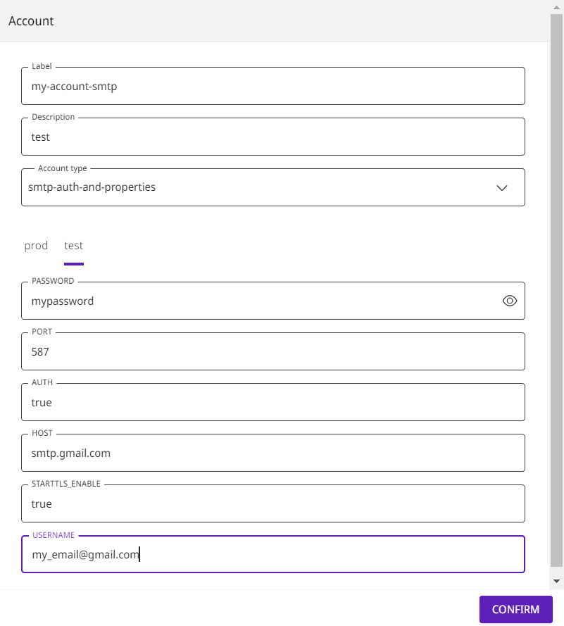

# Como usar sua conta do Gmail com o componente de e-mail Digibee (SMTP)

É bastante útil ter sua própria conta Gmail para fazer envios através do componente de e-mail da Digibee, SMTP.


A abordagem descrita não é recomendada para ambientes produtivos. Leve em consideração que este artigo trata de um tipo de conta obsoleta. Leia o artigo sobre o [componente Email V2](https://docs.digibee.com/documentation/v/pt-br/components/web-protocols/email-v2) e entenda o novo modelo de envio de email.


## Configurando a conta (_account_) 

Para configurar sua Conta Google com o componente SMTP, acesse a Digibee Integration Platform e siga os passos abaixo:

1. Clique no ícone de **Administration**, no canto superior direito da Plataforma.

<figure><figcaption></figcaption></figure>

2. Clique em **Accounts** no menu ao lado esquerdo da tela.

<figure><figcaption></figcaption></figure>

3. Insira as configurações da sua conta do Gmail conforme imagem abaixo:

<figure><figcaption></figcaption></figure>

4. Observe a configuração do nome da Conta (Label) e do tipo (Type).
5. Defina um nome para a conta que depois será utilizada pelo componente de e-mail.
6. Escolha o tipo _smtp-auth-and-properties_.
7. Clique em **CONFIRM**.

### Autorizando o Gmail 

Os envios serão feitos através de SMTP, considerado pelo Gmail um canal menos seguro. Portanto, é necessário autorizar o Gmail a oferecer suporte a aplicativos não seguros.

Leia a [documentação oficial do Google](https://support.google.com/accounts/answer/6010255?hl=pt-BR) para saber como autorizar o Gmail a suportar aplicações não seguras.

### Obtendo o link de autorização 

É possível que o Gmail envie um link de autorização na primeira execução do componente de e-mail. Se isso acontecer, você receberá um erro na primeira execução do seu _pipeline_.

### Conta com duplo fator de autenticação 

É recomendável que você utilize o duplo fator de autenticação na sua conta. Para isso, é necessário criar uma senha de aplicativo.

Leia a [documentação do Google ](https://support.google.com/accounts/answer/185833?hl=pt-BR)para saber como criar uma senha de aplicativo.
